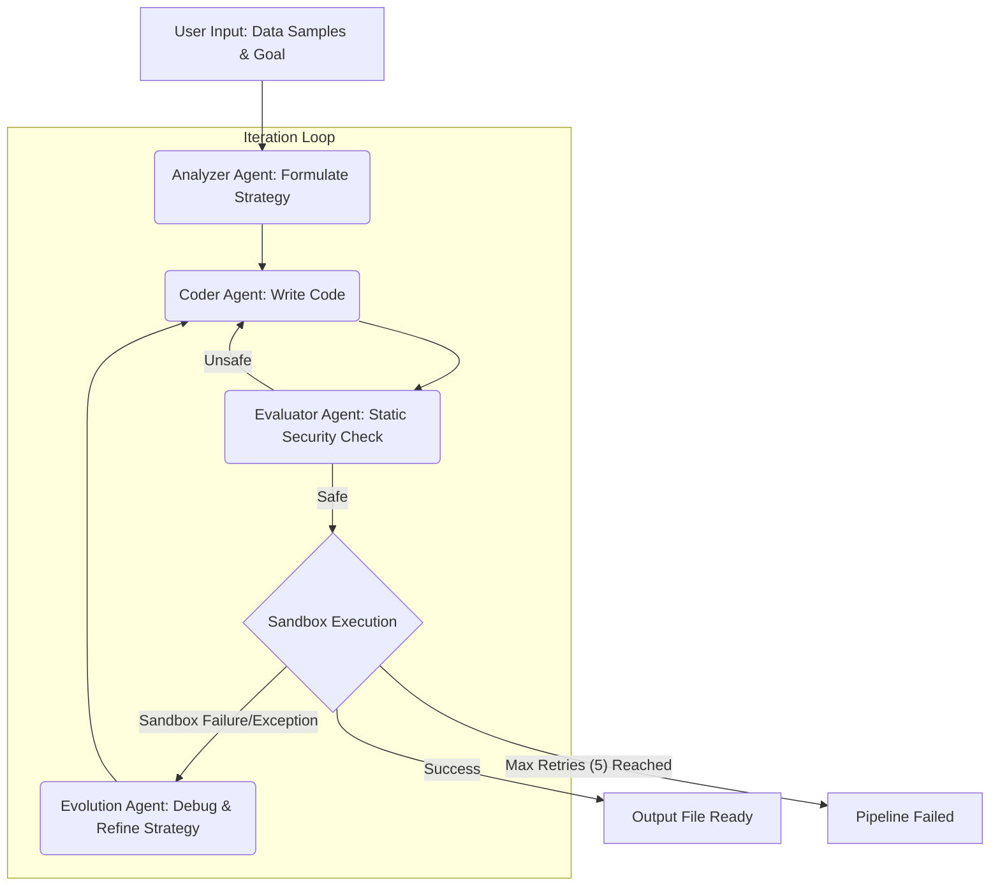

# AI Software Factory Architecture

The AI Software Factory is a self-evolving, multi-agent system designed to automatically synthesize Python algorithms for data transformation tasks, evaluate their safety, execute them in a secure sandbox, and learn from execution failures to refine its code generation. This system is orchestrated using LangGraph to manage the intricate state transitions between various specialized AI agents.

## Core Concepts

The architecture relies on a **Cyclic Directed Graph** (via LangGraph) where nodes represent specialized LLM agents and edges define conditional routing logic based on the outcomes of each stage. A central `AgentState` flows through the graph, accumulating context, generated code, execution logs, and error history.

**Self-Evolution (The Loop):** The critical component is the feedback loop. If the generated code fails to execute or produces incorrect output, the system does not simply halt. Instead, the `execution` logs are fed back into the `evolution` engine, which diagnoses the error and dictates new instructions to the `coder`, enabling the system to iteratively "fix" itself until success or a maximum iteration limit is reached.

---

## Component Breakdown

The system is organized into distinct modules located under the `app/` directory:

### 1. `app/agents/` (The AI Workforce)

These are the nodes of the LangGraph, each driven by a specific prompt and LLM call.

*   **`analyzer.py` (Lead Data Architect):**
    *   **Role:** The entry point. It receives the raw data schema, a sample of the input data, and a description of the desired mathematical/structural transformations.
    *   **Action:** Analyzes the inputs and produces a `proposed_algorithm_strategy` (a step-by-step pseudo-code or logical plan).
*   **`coder.py` (Expert Python Data Engineer):**
    *   **Role:** Translates strategy into executable code.
    *   **Action:** Takes the analysis report, algorithm strategy, and (crucially) any `error_history` and `learned_context` and writes a complete Python script containing a mandatory `transform(input_path, output_path)` function.
*   **`evaluator.py` (Security & QA Reviewer):**
    *   **Role:** Static analysis and guardrail enforcement.
    *   **Action:** Examines the generated string of code for malicious OS commands (e.g., destructive `os.system` calls) and massive syntax errors before allowing execution. It outputs a boolean `is_code_safe` flag. If `False`, it routes back to the Coder.
*   **`evolution.py` (Refinement Engine):**
    *   **Role:** The debugger.
    *   **Action:** If a script fails during execution, this agent analyzes the `execution_logs` (stack traces, logical errors) alongside the failing code. It generates actionable instructions on how to modify the strategy to fix the bug, appending the failure to the `error_history` to prevent cyclical repeating of the same mistakes.

### 2. `app/core/` (Orchestration & State)

*   **`state.py`:** Defines the typed dictionary (`AgentState`) representing the shared memory of the graph. It maintains inputs, outputs from agents, code strings, success flags, and error history across loops.
*   **`orchestrator.py`:** The heart of the system. It defines the LangGraph `StateGraph`, wires up the agent nodes, and declares the conditional routing logic (e.g., `route_execution` which loops back to `evolution` on failure or exits on success).
*   **`llm.py`:** centralized factory to instantiate LangChain LLM clients. It attempts to connect to the EY internal Azure OpenAI service (`EYQ_INCUBATOR_ENDPOINT`) using credentials from the `.env` file, falling back to public OpenAI if needed.
*   **`config.py`:** Pydantic `BaseSettings` for managing environment variables.

### 3. `app/execution/` (The Sandbox)

*   **`sandbox.py`:** Provides an isolated execution environment.
    *   Currently implemented using a controlled `subprocess` execution. It writes the generated code to a temporary file, appends a runner wrapper, and executes it with a strict timeout.
    *   It safely captures `stdout` and `stderr` to return back to the LangGraph for evaluation or evolution.

### 4. `app/api/` and `app/db/` (Future Integrations)

*   **`api/`:** Placeholders for exposing the graph via FastAPI endpoints to trigger jobs asynchronously from automated pipelines.
*   **`db/`:** Infrastructure for vector storage (e.g., Supabase/ChromaDB). This will serve as the system's "Long Term Memory", storing successful strategies matching specific data shapes, permitting the `analyzer` to retrieve proven approaches for similar future tasks.

---

## Workflow Flowchart

## Security Considerations

The system executes LLM-generated code dynamically. Therefore, isolation is paramount.
Currently, the system uses Python's `subprocess` for basic Process isolation with strict execution timeouts to prevent infinite loops (common with LLM hallucinations).
*The roadmap includes upgrading this execution layer to spin up ephemeral Docker containers for full host system isolation.*
