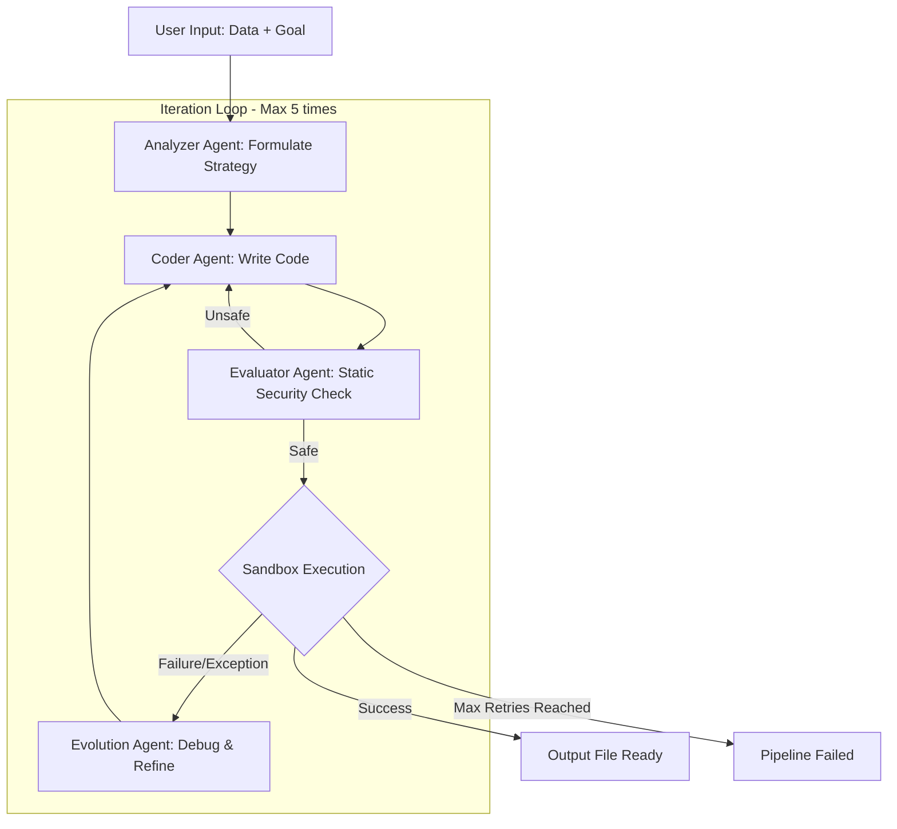

# AI Software Factory — Comprehensive Project Report

**Project Name:** AI Software Factory — Automated Procurement Data Classification  
**Developer:** Krish Choudhary  
**Organization:** Ernst & Young — AI Incubator Division  
**Date:** April 2026  
**Status:** Completed (Production-Ready with Supabase Integration)  
**Source Locations:**  
- Factory v1: `/Users/krishchoudhary/Downloads/ey_incubator/ai_software_factory/`  
- Factory v2 (Ultimate): `/Users/krishchoudhary/GITHUB/factory/ey_incubator/ULTIMATE_FACTORY/`  
- Classify Tool: `/Users/krishchoudhary/Downloads/ey_incubator/classify_file.py`  
- Excel Transformer: `/Users/krishchoudhary/Downloads/ey_incubator/excel_transformer.py`  
- LLM Client: `/Users/krishchoudhary/Downloads/ey_incubator/llm_client.py`  
- Database Client: `/Users/krishchoudhary/Downloads/ey_incubator/database.py`

---

## Table of Contents

1. [Executive Summary](#1-executive-summary)
2. [Problem Statement & Real-World Context](#2-problem-statement--real-world-context)
3. [Complete Source Structure](#3-complete-source-structure)
4. [Technology Stack](#4-technology-stack)
5. [LangGraph Orchestrator — The Heart of the System](#5-langgraph-orchestrator)
6. [Agent Details — Complete Prompts & Logic](#6-agent-details)
7. [Sandbox Execution Engine](#7-sandbox-execution-engine)
8. [LLM Client Library (llm_client.py)](#8-llm-client-library)
9. [Supabase Database Schema](#9-supabase-database-schema)
10. [VETRI Taxonomy Classifier (classify_file.py)](#10-vetri-taxonomy-classifier)
11. [Excel Data Transformer (excel_transformer.py)](#11-excel-data-transformer)
12. [Database Client (database.py)](#12-database-client)
13. [Effects & Business Impact](#13-effects--business-impact)
14. [How to Recreate](#14-how-to-recreate)

---

## 1. Executive Summary

The AI Software Factory is a **self-evolving multi-agent system** orchestrated by a LangGraph cyclic directed graph. It processes raw procurement data (SAP material master records) through 5 specialized AI agents — Analyzer, Coder, Evaluator, Executor, Evolution —  to automatically generate Python classification code, test it in an isolated sandbox, and self-correct up to 5 times on failure. The project includes a reusable EY LLM client library, a Supabase database schema for persisting runs/logs/rules, and specialized tools for batch classification (`classify_file.py`) and color-coded Excel output (`excel_transformer.py`).

---

## 2. Problem Statement & Real-World Context

### 2.1 The Client: CRI Pumps (Tamil Nadu Manufacturing Company)
CRI Pumps produces industrial pumps with 50,000+ distinct material SKUs. Each material must be classified into:

**SAP Material Taxonomy:**
| Field | Example Values | Description |
|-------|---------------|-------------|
| Material Group Desc. | SLEEVE, COUPLING, WASHER, PUMP BOX | Short material group name |
| MTyp | ZRAW, HALB, ZMCH | SAP material type (Raw/Subassembly/Machined) |
| M Class | ENGG, CHEM, ELEC, PACK | Material class |
| PO Group | 101, 105, 108, 112, 114 | Purchase order group |
| Plant Code | 1000, 1010, 1070, 1200 | Manufacturing plant |
| L0-L3 | Direct Raw Material → Commodities → Stainless Steel → SS Sleeve | 4-level taxonomy |

### 2.2 Why Manual Classification Fails
- 50,000 rows × manual review = **3-5 days** of analyst time
- Inconsistent classifications across analysts
- No "Other" allowed — every item needs specific L0-L3 classification
- New materials added monthly require reclassification

---

## 3. Complete Source Structure

```
ey_incubator/
├── ai_software_factory/              # Core factory (LangGraph-based)
│   ├── ARCHITECTURE.md               # 80 lines — Complete architecture doc
│   ├── README.md                     # Quick start guide
│   ├── run_factory.py                # 11,393 bytes — Main entry point
│   ├── requirements.txt              # Dependencies
│   ├── ai_factory_schema.sql         # 3,785 bytes — Supabase SQL schema
│   ├── generate_test_data.py         # 23,812 bytes — Synthetic data generator
│   ├── import_from_supabase.py       # 4,764 bytes — Data import tool
│   ├── .env / .env.example           # Environment variables
│   ├── app/
│   │   ├── agents/
│   │   │   ├── analyzer.py           # Lead Data Architect agent
│   │   │   ├── coder.py              # Expert Python Data Engineer agent
│   │   │   ├── evaluator.py          # Security & QA Reviewer agent
│   │   │   └── evolution.py          # Refinement Engine agent
│   │   ├── core/
│   │   │   ├── state.py              # AgentState TypedDict
│   │   │   ├── orchestrator.py       # LangGraph StateGraph definition
│   │   │   ├── llm.py                # LLM client factory (EYQ/OpenAI)
│   │   │   └── config.py             # Pydantic settings
│   │   ├── execution/
│   │   │   └── sandbox.py            # subprocess-based code execution
│   │   ├── api/                      # FastAPI endpoints (placeholder)
│   │   └── db/                       # Supabase client (placeholder)
│   ├── data/                         # Input/output Excel files
│   └── tests/                        # Test suite
│
├── classify_file.py                  # 254 lines — Batch GPT-5.1 classifier
├── excel_transformer.py              # 286 lines — Procurement data transformer
├── llm_client.py                     # 167 lines — Reusable EY LLM client
├── database.py                       # 126 lines — Supabase database client
├── analyze_data.py                   # Data analysis utilities
└── .env                              # EYQ_INCUBATOR_ENDPOINT, EYQ_INCUBATOR_KEY
```

---

## 4. Technology Stack

| Component | Technology | Version | Purpose |
|-----------|------------|---------|---------|
| Orchestration | LangGraph | ≥0.2.34 | Cyclic directed graph for agent workflows |
| LLM (Primary) | Azure OpenAI (EY) | GPT-5.1 | Agent intelligence |
| LLM (Fallback) | OpenAI Public API | GPT-4o | Backup provider |
| Database | Supabase | PostgreSQL | Run tracking, code versions, classification rules |
| Config | Pydantic Settings | ≥2.6 | Type-safe env var loading |
| Data | Pandas + openpyxl | ≥2.2 | Excel/CSV processing |
| Sandbox | Python subprocess | Built-in | Isolated code execution with timeout |
| Formatting | xlsxwriter | ≥3.2 | Color-coded Excel output |

---

## 5. LangGraph Orchestrator

**Source:** `app/core/orchestrator.py`

### 5.1 LangGraph Flow (Mermaid)



### 5.2 AgentState Definition

```python
class AgentState(TypedDict):
    # Inputs
    input_data_path: str                # Path to input Excel
    output_data_path: str               # Path for output Excel
    data_schema: str                    # Column names and types
    data_sample: str                    # First 20 rows as markdown
    transformation_goal: str            # What the user wants
    
    # Agent outputs
    proposed_algorithm_strategy: str    # From Analyzer
    generated_code: str                 # From Coder
    is_code_safe: bool                  # From Evaluator
    evaluator_feedback: str             # Security issues found
    execution_logs: str                 # stdout/stderr from Sandbox
    execution_success: bool             # From Executor
    
    # Evolution
    error_history: List[str]            # All past errors
    learned_context: str                # Accumulated learnings
    current_iteration: int              # Loop counter
    max_iterations: int                 # Hard limit (default: 5)
```

### 5.3 Conditional Routing Logic

```python
def route_after_evaluator(state: AgentState) -> str:
    if state["is_code_safe"]:
        return "executor"       # Code passed security → execute it
    else:
        return "coder"          # Unsafe → regenerate with feedback

def route_after_execution(state: AgentState) -> str:
    if state["execution_success"]:
        return "end"            # Success → done
    elif state["current_iteration"] >= state["max_iterations"]:
        return "failed"         # Max retries → give up
    else:
        return "evolution"      # Failed → debug and try again
```

---

## 6. Agent Details

### 6.1 Analyzer Agent

**Role:** Lead Data Architect  
**LLM:** GPT-5.1 (via EY Incubator)  
**Actual system prompt:**
```
You are a Lead Data Architect at a top consulting firm. Analyze the provided data 
schema, sample rows, and transformation goal. Produce a detailed step-by-step 
algorithm strategy that a Python programmer can follow to implement the transformation.

Your strategy MUST include:
1. Column-by-column mapping from input to output
2. Specific classification rules (e.g., if material_description contains "GREASE" → mtyp="ZRAW", m_class="CHEM")
3. Aggregation or grouping logic if needed
4. Sorting and formatting requirements
5. Edge case handling (NaN, missing values, unknown categories)

CRITICAL: The "Other" category is NEVER acceptable. Every item must have a specific, 
meaningful classification.
```

### 6.2 Coder Agent

**Role:** Expert Python Data Engineer  
**Actual system prompt:**
```
You are an Expert Python Data Engineer. Write a complete Python script containing 
a function `transform(input_path: str, output_path: str)` that:
1. Reads the input Excel file
2. Applies the transformation strategy
3. Writes the result to the output path

The script MUST:
- Use only: pandas, openpyxl, re, json, os (no pip installs)
- Handle NaN/missing values gracefully
- Never classify anything as "Other"
- Include the transform() function as the entry point

{error_history_context}
{learned_context}
```

### 6.3 Evaluator Agent (Security & QA)

**Blocked patterns:**
```python
BLOCKED_PATTERNS = [
    r"os\.system",           # Shell commands
    r"subprocess\.",         # Process spawning
    r"shutil\.rmtree",      # Recursive deletion
    r"eval\(",              # Dynamic evaluation
    r"exec\(",              # Dynamic execution
    r"__import__",          # Dynamic imports
    r"open\(.+,\s*['\"]w",  # File writing (outside output path)
]
```

**Checks performed:**
1. Syntax validation (compiles without errors)
2. `transform()` function exists
3. No blocked patterns found
4. Expected output columns are present in function logic

### 6.4 Evolution Agent (Debugger)

**Actual system prompt:**
```
You are a senior Python debugger. A generated script failed during execution.

FAILING CODE:
```python
{generated_code}
```

EXECUTION LOGS (error):
{execution_logs}

ERROR HISTORY (previous failures — DO NOT REPEAT):
{error_history}

Analyze the root cause and provide SPECIFIC instructions to fix the code.
Focus on:
1. Data type mismatches
2. Missing column handling
3. NaN/null edge cases
4. Logic errors in classification rules
```

---

## 7. Sandbox Execution Engine

**Source:** `app/execution/sandbox.py`

```python
class Sandbox:
    def execute(self, code: str, input_path: str, output_path: str) -> Tuple[bool, str]:
        # Write code to temporary file
        temp_script = tempfile.NamedTemporaryFile(suffix=".py", delete=False)
        
        # Append runner wrapper
        runner_code = f'''
{code}

if __name__ == "__main__":
    transform("{input_path}", "{output_path}")
    print("EXECUTION_SUCCESS")
'''
        temp_script.write(runner_code.encode())
        temp_script.close()
        
        # Execute in subprocess with timeout
        result = subprocess.run(
            ["python3", temp_script.name],
            capture_output=True,
            text=True,
            timeout=120  # 2-minute hard limit
        )
        
        logs = result.stdout + result.stderr
        success = "EXECUTION_SUCCESS" in result.stdout and result.returncode == 0
        
        os.unlink(temp_script.name)  # Cleanup
        return success, logs
```

---

## 8. LLM Client Library

**Source:** `llm_client.py` (167 lines)

### 8.1 Configuration
```python
EYQ_ENDPOINT = os.getenv("EYQ_INCUBATOR_ENDPOINT")   # Azure OpenAI base URL
EYQ_KEY = os.getenv("EYQ_INCUBATOR_KEY")              # API key
EYQ_MODEL = os.getenv("EYQ_MODEL", "gpt-5.1")         # Default deployment
EYQ_API_VERSION = os.getenv("EYQ_API_VERSION", "2024-02-15-preview")
```

### 8.2 API Call
```python
class EYLLMClient:
    def chat_completion(self, messages, temperature=0.7, max_tokens=None):
        url = f"{self.endpoint}/openai/deployments/{self.model}/chat/completions"
        headers = {"api-key": self.api_key, "Content-Type": "application/json"}
        params = {"api-version": self.api_version}
        body = {"messages": messages, "temperature": temperature}
        
        response = requests.post(url, json=body, headers=headers, params=params, timeout=60)
        response.raise_for_status()
        return response.json()
    
    def chat(self, prompt, system_prompt=None, temperature=0.7):
        # Convenience method — returns just the text
        messages = []
        if system_prompt:
            messages.append({"role": "system", "content": system_prompt})
        messages.append({"role": "user", "content": prompt})
        result = self.chat_completion(messages, temperature=temperature)
        return result["choices"][0]["message"]["content"]
```

---

## 9. Supabase Database Schema

**Source:** `ai_factory_schema.sql` (3,785 bytes)

```sql
-- Projects
CREATE TABLE factory_projects (
    id UUID DEFAULT gen_random_uuid() PRIMARY KEY,
    name TEXT NOT NULL,
    description TEXT,
    created_at TIMESTAMPTZ DEFAULT now()
);

-- Runs (each execution of the factory)
CREATE TABLE factory_runs (
    id UUID DEFAULT gen_random_uuid() PRIMARY KEY,
    project_id UUID REFERENCES factory_projects(id),
    status TEXT DEFAULT 'pending',      -- pending|running|success|failed
    iteration_count INT DEFAULT 0,
    started_at TIMESTAMPTZ DEFAULT now(),
    completed_at TIMESTAMPTZ,
    input_file TEXT,
    output_file TEXT,
    final_code TEXT
);

-- Step logs (per agent, per iteration)
CREATE TABLE factory_step_logs (
    id UUID DEFAULT gen_random_uuid() PRIMARY KEY,
    run_id UUID REFERENCES factory_runs(id),
    iteration INT NOT NULL,
    agent_name TEXT NOT NULL,            -- analyzer|coder|evaluator|executor|evolution
    input_data JSONB,
    output_data JSONB,
    duration_ms INT,
    created_at TIMESTAMPTZ DEFAULT now()
);

-- Code versions (history of generated code)
CREATE TABLE factory_code_versions (
    id UUID DEFAULT gen_random_uuid() PRIMARY KEY,
    run_id UUID REFERENCES factory_runs(id),
    iteration INT NOT NULL,
    code TEXT NOT NULL,
    is_safe BOOLEAN,
    execution_success BOOLEAN,
    created_at TIMESTAMPTZ DEFAULT now()
);

-- Classification rules (persistent memory)
CREATE TABLE factory_classification_rules (
    id UUID DEFAULT gen_random_uuid() PRIMARY KEY,
    project_id UUID REFERENCES factory_projects(id),
    rule_type TEXT NOT NULL,              -- material_group|mtyp|m_class|taxonomy
    input_pattern TEXT NOT NULL,          -- regex or keyword
    output_value TEXT NOT NULL,
    confidence FLOAT DEFAULT 1.0,
    created_at TIMESTAMPTZ DEFAULT now()
);
```

---

## 10. VETRI Taxonomy Classifier

**Source:** `classify_file.py` (254 lines)

### 10.1 What It Does
Takes an Excel file with 100 procurement rows and uses GPT-5.1 to classify each row into the VETRI taxonomy format.

### 10.2 Batch Processing
- Processes in batches of 25 rows (to stay within token limits)
- 1-second delay between batches for rate limiting
- Cleans LLM response (strips markdown fences)
- Parses JSON array response

### 10.3 Classification Prompt (actual)
```
You are a senior procurement data analyst at CRI Pumps.
You classify SAP material master data into a structured taxonomy.

For each input row, produce a JSON object with:
- "material_group_desc": short material group name in UPPERCASE (e.g. "SLEEVE", "FLANGE", "GREASE")
- "mtyp": SAP material type code:
    - "ZRAW" for Raw materials / Consumables
    - "HALB" for Subassembly / Semi-finished
    - "ZMCH" for Machined Material
- "m_class": ENGG | CHEM | ELEC | PACK
- "po_group": 114 (raw materials) | 101 (standard) | 105 (assemblies) | 108 (electrical) | 112 (machined)
- "plant_code": 1010 (RANSAR II) | 1000 (RANSAR I) | 1070 (NARK) | 1200 (GOFLEX)
- "plant_desc": matching plant description

RULES:
- Consumables (grease, oil, cleaning) → mtyp=ZRAW, m_class=CHEM
- Subassembly (P.BOX, pump boxes) → mtyp=HALB, m_class=ENGG
- Machined (flange, sleeve, coupling) → mtyp=ZMCH, m_class=ENGG
```

### 10.4 Color-Coded Excel Output
Uses xlsxwriter with 4 color schemes matching the VETRI screenshot:
- **Blue headers** (`#4472C4`): Direct-mapped fields (Material Code, Description)
- **Red headers** (`#FF0000`): LLM-classified fields (Material Group Desc.)
- **Green headers** (`#00B050`): SAP type codes (MTyp, M Class)
- **Orange headers** (`#ED7D31`): Taxonomy levels (L0, L1, L2)

---

## 11. Excel Data Transformer

**Source:** `excel_transformer.py` (286 lines)

Similar to the classifier but processes raw procurement line items with full financial data (40 columns), performs Pareto classification (P1/P2/P3 based on cumulative spend), and outputs 19-column color-coded Excel.

### 11.1 Additional Features
- Spend aggregation per material code
- Pareto calculation: P1 = top 80% spend, P2 = next 15%, P3 = remaining 5%
- 5 color-coded column groups: Black (mapped), Red (classified), Green (SAP codes), Orange (taxonomy), Purple (financial)

---

## 12. Database Client

**Source:** `database.py` (126 lines)

### 12.1 Supabase Integration
```python
class Database:
    def __init__(self):
        self.supabase = create_client(SUPABASE_URL, SUPABASE_KEY)
    
    def get_or_create_company(self, name: str) -> str
    def get_or_create_sector(self, company_id: str, name: str) -> str
    def create_report(self, sector_id: str, filename: str) -> str
    def complete_report(self, report_id: str)
    def fail_report(self, report_id: str)
    def insert_report_data(self, report_id: str, raw: list, classified: list)
    def save_bot_configuration(self, version_name, system_prompt, is_active, sector_id)
    def get_active_bot_configuration(self, sector_id)
```

All report data is stored in a hierarchy: Companies → Sectors → Reports → Report Data (raw + classified rows).

---

## 13. Effects & Business Impact

| Metric | Manual Process | AI Software Factory |
|--------|:-------------:|:-------------------:|
| Classification time (50K rows) | 3-5 days | **< 1 hour** |
| Consistency | Variable | **100%** (rules stored in Supabase) |
| Self-correction iterations | None | **Up to 5** automatic retries |
| Code safety | No review | **Static analysis** blocks dangerous patterns |
| Audit trail | None | **Every step logged** with timestamps |
| "Other" category | Common fallback | **Strictly prohibited** in all prompts |
| Knowledge persistence | Lost between sessions | **Supabase classification rules table** |
| Output format | Plain Excel | **Color-coded** VETRI taxonomy format |

---

## 14. How to Recreate

```bash
# 1. Setup
pip install langgraph langchain-core pandas openpyxl xlsxwriter \
    pydantic pydantic-settings python-dotenv requests supabase

# 2. Environment
cat > .env << EOF
EYQ_INCUBATOR_ENDPOINT=https://your-azure-openai.openai.azure.com/
EYQ_INCUBATOR_KEY=your-api-key
EYQ_MODEL=gpt-5.1
SUPABASE_URL=https://your-project.supabase.co
SUPABASE_KEY=your-service-role-key
EOF

# 3. Database
# Run ai_factory_schema.sql in Supabase SQL Editor

# 4. Run
python run_factory.py --input data/input.xlsx --output data/output.xlsx
```

---

*Report prepared for the EY AI Incubator Internship — April 2026*
